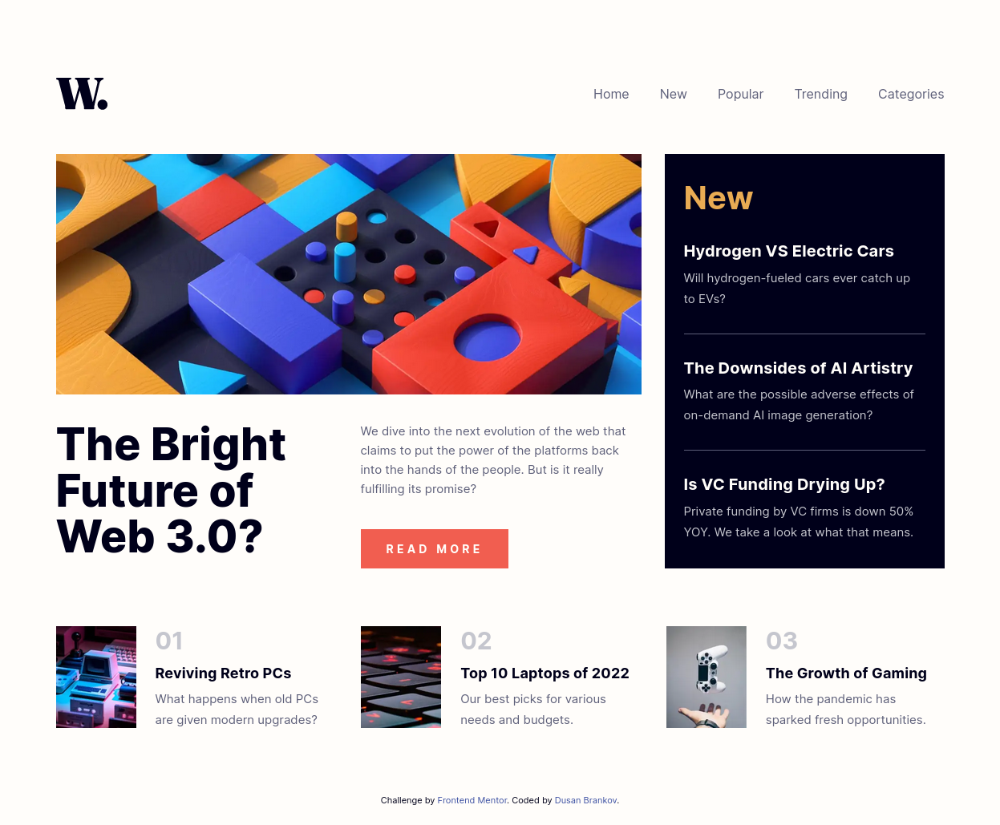

# Frontend Mentor - News homepage

This is a solution to the [News homepage challenge on Frontend Mentor](https://www.frontendmentor.io/challenges/news-homepage-H6SWTa1MFl).

## Users should be able to:

- [x] View the optimal layout for the interface depending on their device's screen size
- [x] See hover and focus states for all interactive elements on the page
- [x] **Bonus**: Toggle the mobile menu (requires some JavaScript)

## Preview site

:computer: <https://dusan-b.github.io/fm-news-homepage/>

## My process

### Built with

- Semantic HTML5 markup
- ARIA attributes
- CSS custom properties
- Flexbox
- CSS Grid
- BEM methodology
- Mobile-first workflow
- JavaScript

### What I learned

*Will follow...*

### Continued development

*Will follow...*

### Useful resources

*Will follow...*

---

**About the author**

GitHub - [dusan-b](https://github.com/dusan-b) 
Frontend Mentor - [@dusan-b](https://www.frontendmentor.io/profile/dusan-b)
